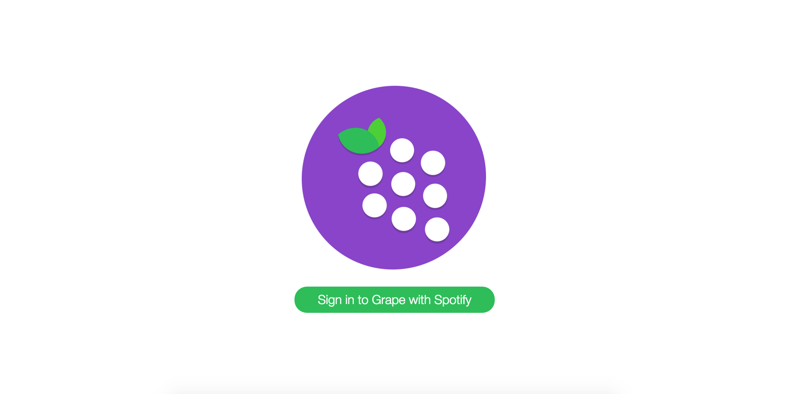
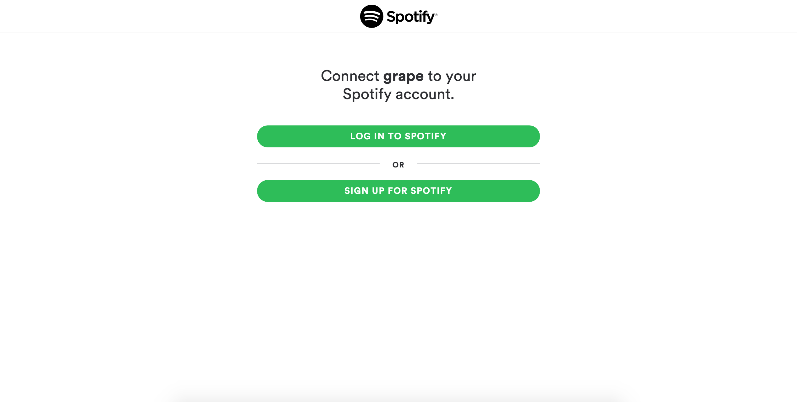
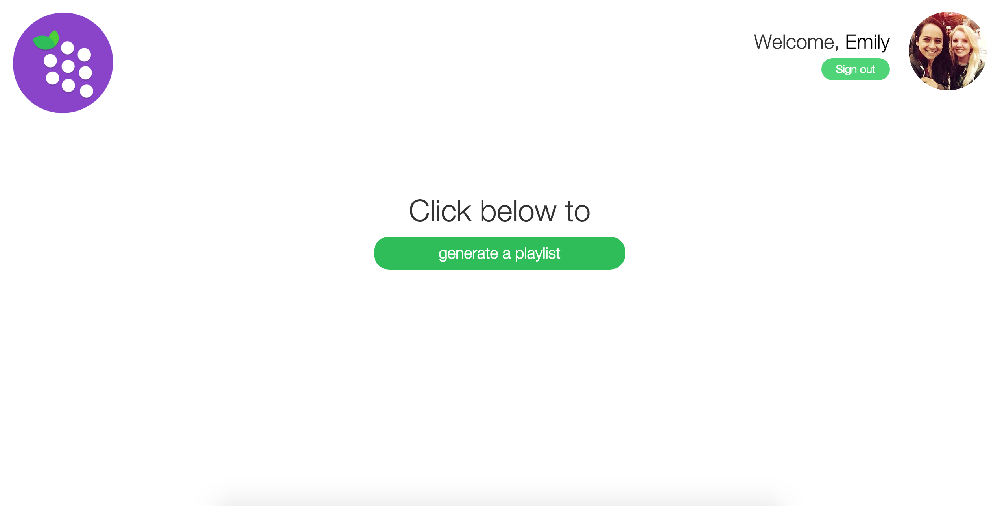
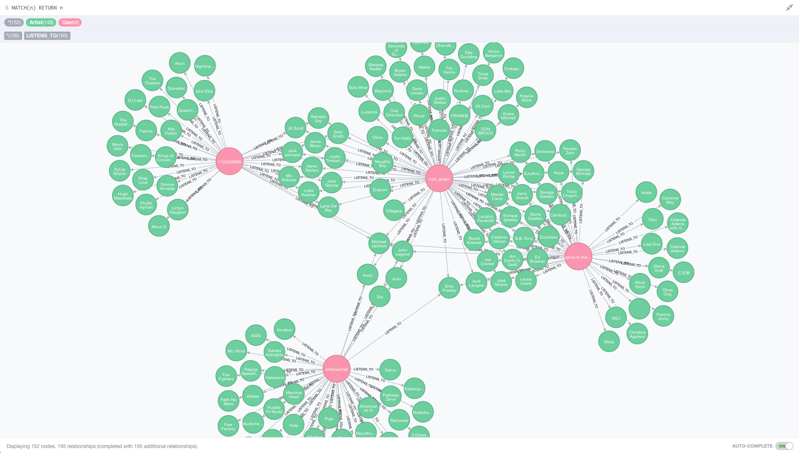

#Grape

**Visit the live site [here](https://grape-music.herokuapp.com/)**

###Summary

This project was built in a 7-day sprint during our last week at Makers Academy.

We found a problem with music recommendation services, where users would have music recommended to them through
computer based algorithms and computer generated decisions. We wanted to bring the social element back to music recommendation sites,
so we produced Grape (because Apple was taken).

Grape allows users to connect with music lovers with similar tastes to them. We used a graph database, Neo4j, to connect users who
have similar playlists, and then recommend music to those users from their connection’s library that they do not have. Grape brings
the social side back to music recommendations, and many users have already discovered some brilliant artists through the site.

## Program Logic

We have built the MVC using Ruby on Rails and used Neo4j as our database. Our recommendation logic is two-fold:
1) Recommend users who are ranked by their number of shared artists with current user and the number of appearance
of each shared artist in both recommended user's and current user's playlists
2) Recommend artists (from each recommended user) who are not already in current user's playlists, who are ranked
by the number of appearance in the recommended user's account
The recommendation and RSpotify API methods are modularized in respective helper files. Feature and unit tests can
be run by writing ‘rspec’ command.

## Getting Started

To clone the repo to your local machine run the following command from your command line
`git clone https://github.com/gavinwcheng/music_discover.git`
To install the gems and dependencies, run `gem install bundler` to install the bundle gem followed by `bundle` to install
the gems in the Gemfile.

Since this project works with the Spotify API, you need to create a Spotify Developer account, which will facilitate the Spotify API.
Fortunately this is very simple to do. First visit https://developer.spotify.com/ and create a new app, giving it a name and description of your choice.
This will take you to a new page where your Client ID and Client Secret are displayed. It’s import these are stored securely on your local machine so we
recommend storing them in your Environment Variables. 
To do this run `open ~/.bash_profile` in the command line and add the following lines to your bash profile:

 `export SPOTIFY_SECRET=<YOUR_CLIENT_SECRET>`
 `export SPOTIFY_ID=<YOUR_CLIENT_ID>`
 
 In the Spotify Developer panel, add a redirect URI of `http://localhost:3000/auth/spotify/callback`. Then save and close.

## Installing Neo4j Database

Visit http://neo4j.com/download/ and download Neo4j onto your machine

Run these following commands in your terminal.

`neo4j:install[community-latest, development]` to install the development database

`rake neo4j:install[community-latest, test]` to install the test database

`rake neo4j:config[test, 7475]` to configure the port number for the test environment

Run `rake neo4j:start` to start the Neo4j server. 

`rake neo4j:start[test]` to start the Neo4j server for the test environment

`rake neo4j:stop` to stop the Neo4j server

`rake neo4j:stop[test]` to stop the Neo4j server for the test environment

When the installation is complete, visit localhost:7474 to check if the database is running on your machine.

---
###Technologies Used:
- Production: Ruby on Rails, Javascript, jQuery, Twitter Bootstrap, SASS, Neo4j, Heroku
- Testing: RSpec, Capybara

---

###How to use Grape:

STEP 1: With the server running, navigate to localhost:3000 and click on ‘Sign in to Grape with Spotify’

STEP 2: This takes you to the Spotify login page, enabling you to connect your Spotify account with 
Grape, either by logging in with your username and password, or through your Facebook account 
(provided your Facebook is connected to your Spotify).

STEP 3: You have now logged in and connected your Spotify account to Grape. This uploads your public 
playlists from your Spotify library into the Neo4j database, connecting you with users already in the 
database with similar music tastes.

 This example shows 4 users signed into Grape and in the database. Each user bubble is connected 
to all of the different artists that they listen to, and two users may be connected by similar artists.

STEP 4: Clicking ‘generate a playlist’ will navigate you to he playlist page, which will first display 
the user who matches your music taste the most. Clicking on a track name will give you the option to play the 
track, save it to your Spotify library, follow the artist or discover more from that artist (which opens the Spotify application). 
Clicking the arrow on the right-hand-side will take you to the recommended playlist from the next user matched with you. 
Clicking the logo will take you back to the homepage and the photo icons and usernames will open Spotify, taking you to the relevant profile pages.

---

###Team Members:

[Adrian](https://github.com/Adrian1707)

[Dom](https://github.com/dbatten4)

[Emily](https://github.com/emilyworrall)

[Gavin](https://github.com/gavinwcheng)

---
